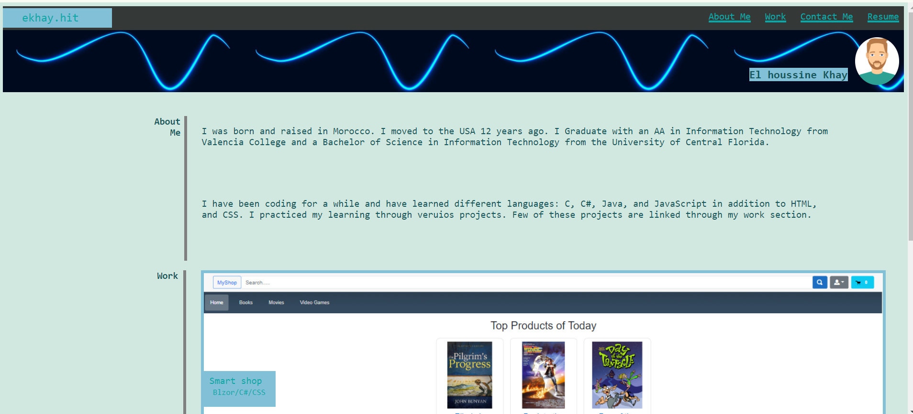
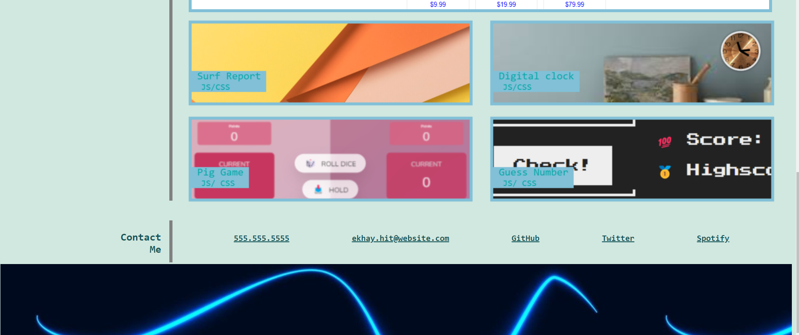

# Portfolio

## Description

This Portiflio was creatd by following a specific layout requirment. It is developed using HTML, and CSS only

## Installation

N/A

## Usage

- The Portfilio contains 3 sections.
- Section one displays information about the student.
- Second section displays the work for the student
- The third section contain contact information about the student.
- Each link in the navigation bar is linked with its correspondent section

## Credits

N/A

## License

Please refer to the LICENSE in the repo.

## Link to the application and screenshots
* link to the application: https://ekhay-hit.github.io/Portfolio/
* Screenshots of the application

